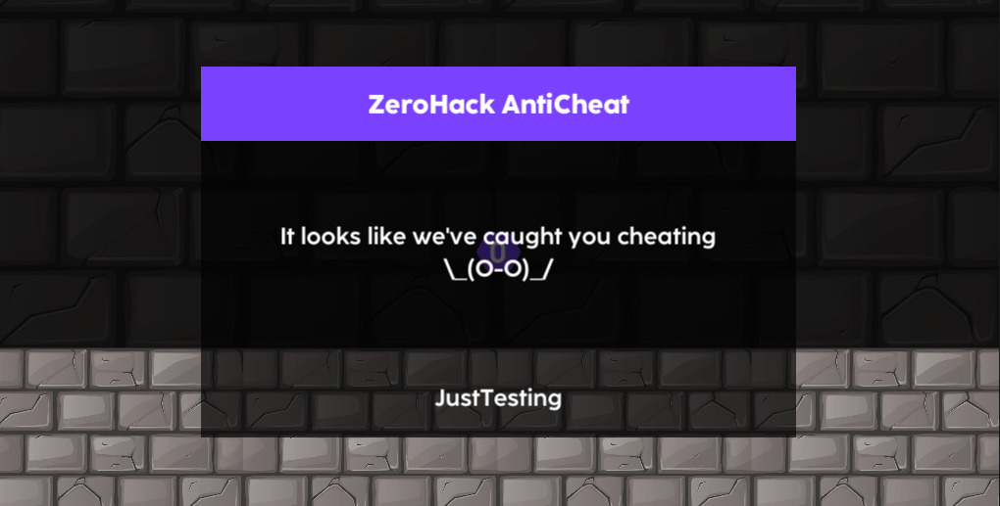

# Editing ZeroHack Settings  

The ZeroHack Settings File contains all configurations for ZeroHack.  
To access it, run ZeroHack > Edit Anticheat Settings.  
  

# Setting Up Punishments  

To create a punishment, you'll have to create a ScriptableObject to use as an Event.  
Take a look at this basic example:  
```csharp

using UnityEngine;
using ZeroHack;

[CreateAssetMenu(menuName = "ZeroHack/Example/Warn")]
public class Warn : ScriptableObject
{
    public void OnCheat(AntiCheatStatus status)
    {
        Debug.LogWarning(status);
    }
}


```  
You can now right-click anywhere in the project panel, and click Create > ZeroHack > Example > Warn.  
  
Then, drag the ScriptableObject into the [ZeroHack Settings](gettingstarted?id=editing-zerohack-settings).
Assign the OnCheat function as a Dynamic AntiCheatStatus event.
  
> NOTE: If you want [testing](/gettingstarted.md?id=testing-punishments) to work when you're not in play mode, you'll have to change "Runtime" to "Editor And Runtime"  

Keep in mind that the function does not have to be called OnCheat, and the class does not have to be called Warn.  
You can tweak all of these things to your liking.  
If everything is done correctly, then you should be able to see a message in the console when [testing](/gettingstarted.md?id=testing-punishments).  
  

# Advanced Punishments  

Most likely, you'll want your punishments to actually do something in the scene, so this is how.  
In this example, we'll create a punishment to display a warning.  
For this, we will have to access objects in the scene.
To do that, add a DiscoverableObject component to all the objects that you want to be accessible.  
Make sure you change the object IDs to something unique, but recognizable.  
  
Now comes the fun part, in your punishment function, call Punishment.GetObject() to get a reference to a GameObject.  
You can then do whatever you want with that object.  
```csharp

public void OnCheat(AntiCheatStatus status)
{
    Punishment.GetObject("CheatingPopup").SetActive(true);
    Punishment.GetObject("CheatingReason").GetComponent<Text>().text = status.ToString();
}

```

Of course, you don't have to use this method.  
You could always use GameObject.Find, GameObject.FindObjectWithTag, GameObject.FindObjectOfType, etc  

  

# Testing Punishments  

You'll probably have to check if your punishments work at some point.  
It's very simple, just run ZeroHack > Test Punishments  
  
The AntiCheatStatus paramater will be AntiCheatStatus.JustTesting.