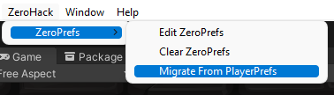
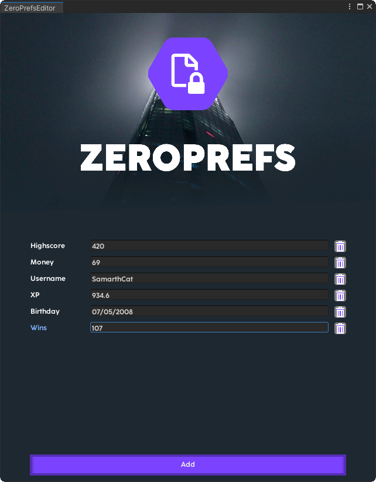

# ZeroPrefs


ZeroPrefs is a drop-in replacement for Unity's built-in PlayerPrefs.  
It automatically encrypts all values, with a key unique to each user.  
This ensures that players can't share values with others.

# Migrating From PlayerPrefs

> WARNING: The Migration Tool Modifies Your Scripts, It Is Recommended To Make A Backup Before Migrating

The easiest way to migrate is to run ZeroHack > ZeroPrefs > Migrate From PlayerPrefs.  
  
This action will:
- Gather All Existing PlayerPrefs
- Encrypt Them
- Modify Scripts To Use ZeroPrefs

# Manual Migration

If auto migration fails, or you just don't trust it, you can manually update your scripts.  
Just replace ``` PlayerPrefs ``` with ``` ZeroHack.ZeroPrefs ``` in your scripts, it's as easy as that!  
> NOTE: Manually Updating Your Scripts Will Not Convert Stored Prefs, You'll Have To Clear Them Before Using ZeroPrefs


# Using The ZeroPrefs Editor  

If all goes well, then you should be able to see your Prefs in the editor.  
To open the editor, go to ZeroHack > ZeroPrefs > Edit ZeroPrefs  
  

The ZeroPrefs editor is very simple, but reliable and easy to use.  
  
Press Add to create a key, and press trash to remove a key.